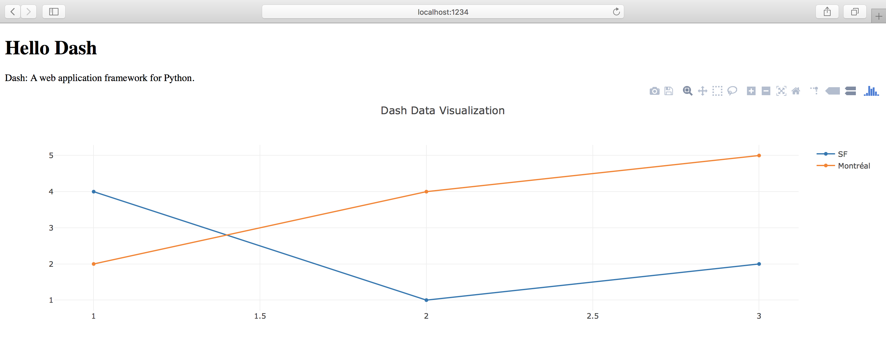
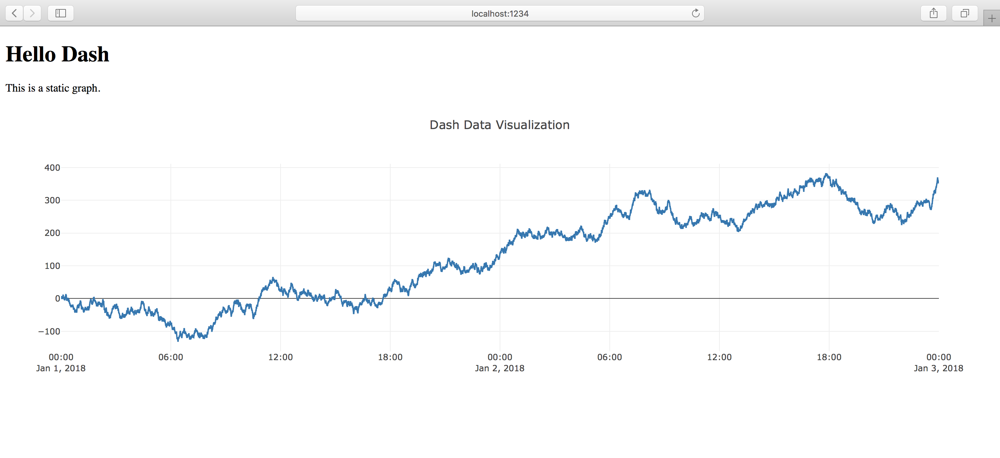
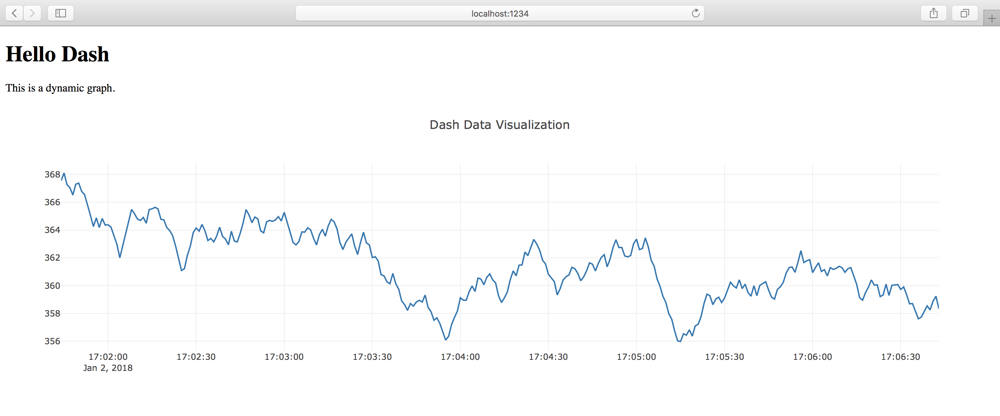
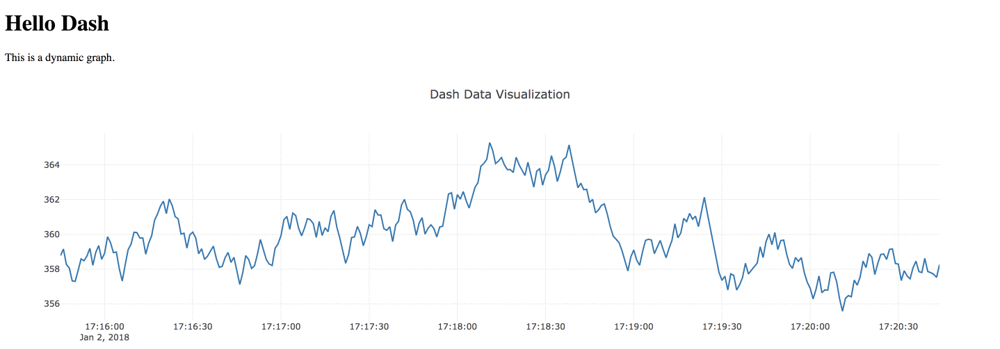

# Dash live charts

## Meta

This is an example lesson, after flask basics and data visualization. 

## Contents
- Intro and flask retro
- hard-coded chart
- static chart
- dynamic chart:
  - user (reload) driven
  - event (time) driven


## Intro and flask retrospection

In real life as a Data Scientist we wouldn't deploy our models or results alone, but more likely in collaboration with DevOps and/or Data Engineers, but sometimes it could be handy to make quick interactive visualizations manually by ourselves instead of use Tableau, PowerBI or something similar.

As we have seen in our previous lesson, with Flask we can build apps for various purposes.  
In this lesson we are going to use plot.ly's dash library (which was built upon flask) to make live charts. [plot.ly](https://plot.ly/) is a web-based visualization tool, and [dash](https://plot.ly/dash/) is one of their open source projects.

## Let's get stared!

### Installing dependencies

It's a wise decision to use a `virtualenv` for the cleanliness of the project.

```shell
virtualenv -p python3 venv
source venv/bin/activate

pip install dash==0.20.0  # The core dash backend
pip install dash-renderer==0.11.3  # The dash front-end
pip install dash-html-components==0.8.0  # HTML components
pip install dash-core-components==0.18.1  # Supercharged components
pip install plotly --upgrade  # Plotly graphing library used in examples

pip install pandas
```
## Hard-coded chart

Our first chart will be very simple, a "hello-world" in dash. (It's also the ["official" hello-world](https://plot.ly/dash/getting-started#dash-app-layout).)

```python
import dash
import dash_core_components as dcc
import dash_html_components as html

app = dash.Dash()

app.layout = html.Div(children=[
    html.H1(children='Hello Dash'),
    html.Div(children='''Dash: A web application framework for Python.'''),
    dcc.Graph(
        id='example_graph',
        figure={
            'data': [
                {'x': [1, 2, 3], 'y': [4, 1, 2], 'type': 'line', 'name': 'SF'},
                {'x': [1, 2, 3], 'y': [2, 4, 5], 'type': 'line', 'name': u'Montréal'},
            ],
            'layout': {'title': 'Dash Data Visualization'}
        }
    )
])

if __name__ == '__main__':
    app.run_server(debug=True, port=1234)
```
### Explanation

It's pretty self-explanatory:
- we import the dependencies
- we create an instance of the `Dash` class (it's like a `Flask` object)
- define a layout for the app
- then run the application on `port 1234`

In the layout we specified the `html` structure of the page:

```html
<div>
    <h1> 
        Hello Dash
    </h1>
    <div>
        Dash: A web application framework for Python.
    </div>
    <div>
        <!–– and here comes the graph ––> 
    </div>
</div>
```
### Let's try it!

Name it `app.py`, and start it with: `python app.py`.  
While it's running visit `localhost:1234` in your browser, you should get something like this:



## Static chart
Okay, it's not the most beautiful page we've ever seen, but it's functioning and the pimping is unfortunately out of the current scope.

You may noticed we input the data in the layout *explicitly*, so there's no way it ever changes. 
Now we begin a journey, step-by-step we will achieve that the data is loaded automatically in the background.


### First step

We are going to use a dummy dataset, it's generated for 2018-01-01 and 2018-01-02.
##### 1. task
Let's have a look at it!  

It's stored in `timeseries.csv`. Read into a `pandas` `DataFrame` and print it!

```python
import pandas as pd  #given
pd.set_option("display.max_rows",20) #given

df = pd.read_csv('timeseries.csv')
print(df)
```

Output:
```
<bound method NDFrame.head of                        time       value
0       2018-01-01 00:00:00    2.807549
1       2018-01-01 00:00:01    3.651251
2       2018-01-01 00:00:02    3.915406
3       2018-01-01 00:00:03    4.247217
4       2018-01-01 00:00:04    4.412219
5       2018-01-01 00:00:05    3.819266
6       2018-01-01 00:00:06    3.706942
7       2018-01-01 00:00:07    4.274660
8       2018-01-01 00:00:08    3.659186
9       2018-01-01 00:00:09    4.642392
...                     ...         ...
172790  2018-01-02 23:59:50  352.428789
172791  2018-01-02 23:59:51  351.989785
172792  2018-01-02 23:59:52  352.736577
172793  2018-01-02 23:59:53  352.395523
172794  2018-01-02 23:59:54  352.454647
172795  2018-01-02 23:59:55  353.230004
172796  2018-01-02 23:59:56  352.651570
172797  2018-01-02 23:59:57  353.638351
172798  2018-01-02 23:59:58  354.485237
172799  2018-01-02 23:59:59  354.477275

[172800 rows x 2 columns]>
```

##### 2. task
Next, we would like to modify the previous chart: change the hard-coded datapoints to this dataframe.
Here are the TODOs:
- import pandas 
- read the data into a `DataFrame`
- modify the graph component to the new data:
  - let the 'x' be the time column,
  - and 'y' be the value
- save the file (in debug mode the flask app reloads automatically)

```python
import dash
import dash_core_components as dcc
import dash_html_components as html
import pandas as pd

app = dash.Dash()

df = pd.read_csv('timeseries.csv')

app.layout = html.Div(children=[
    html.H1(children='Hello Dash'),
    html.Div(children='''This is a static graph. '''),
    dcc.Graph(
        id='example_graph',
        figure={
            'data': [{'x': df['time'], 'y': df['value'], 'type': 'line', 'name': 'timeserie'}],
            'layout': {'title': 'Dash Data Visualization'}
        }
    )
])

if __name__ == '__main__':
    app.run_server(debug=True, port=1234)
```



Magnificent!

## Dynamic chart

Now we going to cheat a little bit. We need dynamic data, but we haven't got any, so let's pretend today is 2018-01-02!

At this time we would like to plot not the whole dataset but only the last 5 minutes.

##### 3. task
Write a function which returns the current time, and the time 5 minutes ago.  
(Tip: use `datetime.datatime.now()` and `datetime.timedelta()`.)

```python
import datetime  # given
def get_last_five_minutes():  # given
    time_now = datetime.datetime.now()
    time_limit = time_now - datetime.timedelta(minutes=5)
    
    return time_now, time_limit  # given
```

##### 4. task
Okay, let's travel time: modify the function to (regardless of the actual date today) return 2018-01-02.  
(Tip: use `date.replace(year=2018, month=1, day=2)`.)

```python
def get_last_five_minutes():
    time_now = datetime.datetime.now().replace(year=2018, month=1, day=2)
    time_limit = time_now - datetime.timedelta(minutes=5)
    
    return time_now, time_limit
```

##### 5. task
Write a function which selects the values of the last five minutes!  
(Tip: since we read the dates from a text file, the python interpreter isn't aware of they are actually dates, so we have to convert them to `date` objects or convert the `date` object to `string`s. This latter one is much easier, so let's use this one.)

```python
def get_last_five_minutes():
    time_now = datetime.datetime.now().replace(year=2018, month=1, day=2)
    time_limit = time_now - datetime.timedelta(minutes=5)
    
    df = pd.read_csv('timeseries.csv')
    condition = (df['time'] > str(time_limit)) & (df['time'] < str(time_now))
    
    return df[condition]  #given 
```

##### 6. task
Let's get back to the dash app, insert this functionality.
```python
import dash
import dash_core_components as dcc
import dash_html_components as html
import pandas as pd
import datetime 

def get_last_five_minutes():
    time_now = datetime.datetime.now().replace(year=2018, month=1, day=2)
    time_limit = time_now - datetime.timedelta(minutes=5)
    
    df = pd.read_csv('timeseries.csv')
    condition = (df['time'] > str(time_limit)) & (df['time'] < str(time_now))
    
    return df[condition]

app = dash.Dash()

df = get_last_five_minutes()

app.layout = html.Div(children=[
    html.H1(children='Hello Dash'),
    html.Div(children='''This is a dynamic graph.'''),
    dcc.Graph(
        id='example_graph',
        figure={
            'data': [{'x': df['time'], 'y': df['value'], 'type': 'line'}],
            'layout': {'title': 'Dash Data Visualization'}
        }
    )
])

if __name__ == '__main__':
    app.run_server(debug=True, port=1234)
```



Nice! Here it's 17:06, and it shows the last 5 minutes! 

### Oh wait! 
It would show data between 17:01 and 17:06 every time, because the app was started at 17:06, and the data won't change either in this way.

Fortunately there is solution for this use-case.

##### 7. task
Let's write a wrapper function which accepts zero input attribute, and returns a figure dictionary for the `dcc.Graph` object component (with the proper data, seen as above).  
(Tip: use the previous `get_last_five_minutes()` function!)

```python
def get_figure():
    df = get_last_five_minutes()

    figure = {
        'data': [{'x': df['time'], 'y': df['value'], 'type': 'line'}],
        'layout': {'title': 'Dash Data Visualization'}
    }
    return figure
```

##### 8. task

Replace the current figure dictionary with the function!

```python
import dash
import dash_core_components as dcc
import dash_html_components as html
import pandas as pd
import datetime  # given

def get_last_five_minutes():
    time_now = datetime.datetime.now().replace(year=2018, month=1, day=2)
    time_limit = time_now - datetime.timedelta(minutes=5)
    
    df = pd.read_csv('timeseries.csv')
    condition = (df['time'] > str(time_limit)) & (df['time'] < str(time_now))
    
    return df[condition]

def get_figure():
    df = get_last_five_minutes()

    figure = {
        'data': [{'x': df['time'], 'y': df['value'], 'type': 'line'} ],
        'layout': {'title': 'Dash Data Visualization'}
    }
    return figure

app = dash.Dash()

app.layout = html.Div(children=[
    html.H1(children='Hello Dash'),
    html.Div(children='''This is a dynamic graph.'''),
    dcc.Graph(
        id='example_graph',
        figure=get_figure()
    )
])

if __name__ == '__main__':
    app.run_server(debug=True, port=1234)
```
We're not there yet, now we have to choose between two possibilities:
- the data is reloaded when the user reloads the browser
- the data is reloaded automatically by a time trigger (eg. in every second)

## First solution (reloading)

##### 9. task
For this we only need to restructure the code.
Let's write a wrapper function which returns the whole layout.  
(Tip: use the previous functions.)

```python
def get_layout():
    return html.Div(children=[
        html.H1(children='Hello Dash'),
        html.Div(children='''This is a dynamic graph. '''),
        dcc.Graph(
          id='example_graph',
          figure=get_figure()
        )
    ])
```

##### 10. task

Now assign the function *itself* (and not the return value of the function ) to the `app.layout`.

```python
import dash
import dash_core_components as dcc
import dash_html_components as html
import pandas as pd
import datetime  # given

def get_last_five_minutes():
    time_now = datetime.datetime.now().replace(year=2018, month=1, day=2)
    time_limit = time_now - datetime.timedelta(minutes=5)
    
    df = pd.read_csv('timeseries.csv')
    condition = (df['time'] > str(time_limit)) & (df['time'] < str(time_now))
    
    return df[condition]

def get_figure():
    df = get_last_five_minutes()

    figure = {
        'data': [{'x': df['time'], 'y': df['value'], 'type': 'line'}],
        'layout': {'title': 'Dash Data Visualization'}
    }
    return figure

def get_layout():
    return html.Div(children=[
        html.H1(children='Hello Dash'),
        html.Div(children='''This is a dynamic graph.'''),
        dcc.Graph(
          id='example_graph',
          figure=get_figure()
        )
    ])

app = dash.Dash()

app.layout = get_layout

if __name__ == '__main__':
    app.run_server(debug=True, port=1234)
```

Now every time you reload the page, the time is correct.

## Second solution (time-to-time)

In order to do that we'll need a trigger object and use a decorator (if you don't familiar with decorators, don't worry, they don't bite: think about them as some kind of extensions for the function).

The trigger looks like this (1000 means 1000 milliseconds):

`dcc.Interval(id='graph_update_trigger', interval=1000)`

For the decorator we have to pass which trigger should modify which object. So we have a `graph_update_trigger` trigger ID, and an `example_graph` graph ID. The decorator goes right before the update function which is called when the trigger gives the signal, and return the new value of the graph object.

```python 
@app.callback(dash.dependencies.Output('example_graph', 'figure'), 
        events=[dash.dependencies.Event('graph_update_trigger', 'interval')])
def update_graph():
    new_figure = get_figure()
    return new_figure
```

##### 11. task
Let's build it into the app, insert the trigger object before the graph object, and insert the new `update_graph()` function after the layout!

```python 
import dash
import dash_core_components as dcc
import dash_html_components as html
import pandas as pd
import datetime  # given

def get_last_five_minutes():
    time_now = datetime.datetime.now().replace(year=2018, month=1, day=2)
    time_limit = time_now - datetime.timedelta(minutes=5)

    df = pd.read_csv('timeseries.csv')
    condition = (df['time'] > str(time_limit)) & (df['time'] < str(time_now))

    return df[condition]

def get_figure():
    df = get_last_five_minutes()

    figure = {
        'data': [{'x': df['time'], 'y': df['value'], 'type': 'line'}],
        'layout': {'title': 'Dash Data Visualization'}
    }
    return figure

app = dash.Dash()

app.layout = html.Div(children=[
    html.H1(children='Hello Dash'),
    html.Div(children='''This is a dynamic graph.'''),
    dcc.Interval(id='graph_update_trigger', interval=1000),
    dcc.Graph(
        id='example_graph',
        figure=get_figure()
    )
])

@app.callback(dash.dependencies.Output('example_graph', 'figure'), 
    events=[dash.dependencies.Event('graph_update_trigger', 'interval')])
def update_graph():
    new_figure = get_figure()

    return new_figure

if __name__ == '__main__':
    app.run_server(debug=True, port=1234)

```



And voilà: it reloads automatically in every second.

## Recap

Today we've learned how to make a basic dash/flask application with "live" data.

### When to use it and when not to?

Use it when you want a quick live visualization, and show it to other engineers, but not to customers.
For customers it's better to use something professional and robust.

### Further readings and advancements

- It's not a coincidence we've used decorators. In this same way can we process input fields (text fields, buttons etc.) in order to make [interactive visualizations](https://plot.ly/dash/getting-started-part-2). 
- If your data is sensitive you better to use [authentication](https://plot.ly/dash/authentication).
- If we want to use real live data, we should have a database connection or an API endpoint.
- We didn't deal with performance questions.
